# Arquitectura del Sistema: Screaming Modular Monolith

Este documento describe los principios arquitectónicos, las decisiones de diseño (ADRs), el modelo de componentes y las reglas estructurales que rigen `fastapi-saas-boilerplate`.

---

## 1. Visión Arquitectónica

El proyecto implementa una arquitectura **Screaming Modular Monolith** adaptada a Python y FastAPI. El objetivo principal es que la estructura del código **grite el dominio del negocio** (Usuarios, Facturación, Organizaciones) en lugar de la tecnología subyacente, manteniendo una separación estricta de responsabilidades (SOLID) sin caer en la sobre-ingeniería de carpetas profundas.

```mermaid
flowchart TD
    Client[Cliente / Frontend / API Consumer] --> Transport[Capa de Transporte: FastAPI Routes]
    Transport --> Auth[Capa de Seguridad: Cognito JWT / API Key]
    Transport --> RateLimit[Capa de Rate Limiting: SlowAPI]
    Transport --> Services[Capa de Aplicación: Services / Use Cases]
    
    Services --> DomainModels[(Persistencia: SQLAlchemy ORM)]
    Services --> Gateways[Capa de Adaptadores: Gateways]
    Services --> Protocols[Contratos: Protocols / Interfaces]
    Gateways -.-> Protocols
    Gateways --> ExternalStripe[Stripe API]
    Services --> EmailSender[Email Dispatcher]
    EmailSender --> SES[AWS SES]
    EmailSender --> Mailpit[Mailpit SMTP]
    Services --> Queue[Cola Asíncrona: ARQ + Redis]
    Queue --> Worker[Worker Process]
```



---

## 2. Estructura de Directorios

```text
api/
├── core/                        # CAPA TRANSVERSAL (Infraestructura Compartida)
│   ├── config.py                # Configuración y variables de entorno (Pydantic Settings)
│   ├── database.py              # Motor SQLAlchemy, AsyncEngine y Sesiones
│   ├── security.py              # Autenticación dual (Cognito RS256 JWT + API Key hash)
│   ├── limiter.py               # Rate limiting distribuido (SlowAPI)
│   ├── email.py                 # Renderizado Jinja2 y envío (Mailpit / SES)
│   ├── logging/                 # Observabilidad y tracing
│   │   ├── logger.py            # RichHandler en dev/tests, JSON en prod
│   │   └── middleware.py        # Registro de accesos y latencia con X-Request-ID
│   └── protocols/               # Contratos abstractos (DIP)
│       ├── payment.py           # PaymentGatewayProtocol
│       └── email.py             # EmailSenderProtocol
│
├── modules/                     # CAPA DE DOMINIO (Screaming Feature Modules)
│   ├── users/                   # Identidad, Perfil y Llaves de API
│   │   ├── models.py            # Modelos ORM (UserProfile, UserSettings)
│   │   ├── schemas.py           # Contratos DTO de entrada/salida (Pydantic v2)
│   │   ├── services.py          # Casos de uso de negocio (UserService)
│   │   └── routes.py            # Thin Controller HTTP
│   │
│   ├── billing/                 # Monetización, Checkout y Suscripciones
│   │   ├── models.py            # Modelos ORM (StripeCustomer, StripeWebhookEvent)
│   │   ├── schemas.py           # Contratos DTO de facturación
│   │   ├── gateway.py           # Adaptador StripePaymentGateway (implementa PaymentGatewayProtocol)
│   │   ├── services.py          # Casos de uso de facturación (BillingService)
│   │   └── routes.py            # Thin Controller HTTP
│   │
│   └── organizations/           # Multi-tenancy B2B, Equipos y RBAC
│       ├── models.py            # Modelos ORM (Organization, Member, Invitation)
│       ├── schemas.py           # Contratos DTO de organizaciones
│       ├── dependencies.py      # Guards RBAC (require_org_role, require_feature)
│       ├── services.py          # Casos de uso de equipos (OrganizationService)
│       └── routes.py            # Thin Controller HTTP
│
├── templates/                   # Plantillas HTML responsivas para emails
│   └── emails/
├── worker.py                    # Worker asíncrono para tareas en background (ARQ + Redis)
└── main.py                      # Ensamblado del framework, Lifespan y Health Check
```

---

## 3. Cumplimiento de Principios SOLID

| Principio | Aplicación en el Proyecto |
| :--- | :--- |
| **S - Single Responsibility** | Las rutas (`routes.py`) solo gestionan el transporte HTTP. La lógica de negocio reside en `services.py`. Las llamadas a APIs externas residen en `gateway.py` o `email.py`. La persistencia reside en `models.py`. |
| **O - Open/Closed** | El sistema de pagos y emails utiliza protocolos (`typing.Protocol`). Para añadir un nuevo proveedor (ej. LemonSqueezy o Resend), se crea un nuevo adaptador sin modificar las reglas de negocio existentes. |
| **L - Liskov Substitution** | Cualquier adaptador que implemente `PaymentGatewayProtocol` puede sustituir a `StripePaymentGateway` sin romper el comportamiento de `BillingService`. |
| **I - Interface Segregation** | Los protocolos son pequeños y específicos (`PaymentGatewayProtocol`, `EmailSenderProtocol`) en lugar de interfaces monolíticas. |
| **D - Dependency Inversion** | Los servicios de negocio no importan SDKs concretos (`stripe`, `boto3`); dependen de contratos abstractos inyectados en tiempo de ejecución. |

---

## 4. Reglas de Arquitectura

Para mantener la base de código limpia y libre de acoplamientos indeseados, se establecen las siguientes reglas:

1. **Rutas Delgadas (Thin Controllers)**:
   - Ninguna función en `routes.py` debe ejecutar consultas SQL complejas directamente ni realizar llamadas directas a SDKs externos (`stripe`, `boto3`).
   - `routes.py` solo debe:
     1. Validar la entrada con Schemas de Pydantic.
     2. Resolver dependencias (`Depends`).
     3. Invocar al método correspondiente en el `Service`.
     4. Encolar tareas en segundo plano (`background_tasks` o `enqueue_job`).
     5. Retornar el Schema de respuesta o código HTTP adecuado.

2. **Casos de Uso en Servicios (`services.py`)**:
   - Todo flujo de negocio (ej. *"crear una suscripción"*, *"invitar a un miembro"*, *"generar una API Key"*) debe encapsularse en un método dentro de un Service.
   - Los servicios son clases comprobables mediante tests unitarios rápidos.

3. **Inversión de Pasarelas (`gateway.py`)**:
   - Cualquier interacción con Stripe debe estar contenida dentro de `api/modules/billing/gateway.py`.
   - Si se requiere simular la pasarela en entornos de testing, basta con inyectar un mock o un `DummyPaymentGateway` que cumpla `PaymentGatewayProtocol`.

---

## 5. Modelo de Seguridad y Tenancy

### Autenticación Dual
El sistema soporta dos vías de autenticación transparentes:
- **JWT de AWS Cognito**: Validado mediante firma criptográfica RS256 contra las claves públicas JWKS de Cognito.
- **API Keys**: Formato Bearer o header `X-API-Key`. Las claves crudas se entregan una sola vez al usuario; la base de datos almacena únicamente el hash SHA-256 (`api_key_hash`) y un prefijo de 8 caracteres (`api_key_prefix`) para auditoría.

### Multi-Tenancy B2B y RBAC
- Cada usuario puede crear múltiples organizaciones o pertenecer a varias con distintos roles (`owner`, `admin`, `member`).
- El acceso a recursos de una organización se valida mediante la dependencia `get_current_org_membership`.
- Permisos específicos se controlan mediante `require_org_role(["owner", "admin"])`.
- Funcionalidades del plan se protegen mediante `require_feature("feature_name")`.

---

## 6. Sistema de Background Workers

El procesamiento pesado o diferido (envío de emails transaccionales, sincronizaciones) se desacopla del ciclo de vida HTTP:
- **ARQ + Redis**: En producción, las tareas se encolan en Redis mediante `enqueue_job()`.
- **Fallback Síncrono Automático**: En entornos de desarrollo o tests donde Redis no esté activo, el sistema detecta la ausencia de conexión y ejecuta la función síncronamente en un hilo seguro, evitando bloqueos.

---

## 7. Observabilidad y Logging

- **Desarrollo**: Emplea `RichHandler` de la librería `rich`. Los logs de consola muestran niveles coloreados, timestamps legibles y trazas de excepción con inspección de código fuente (`rich.traceback`).
- **Producción**: Si `ENVIRONMENT="production"`, se activa automáticamente el `JSONFormatter`, emitiendo una sola línea JSON por registro con metadatos estructurados (`timestamp`, `level`, `message`, `request_id`) ideal para agregadores como Datadog, AWS CloudWatch o Grafana Loki.
- **Trazabilidad (`X-Request-ID`)**: El `LoggingMiddleware` genera un UUIDv4 por cada petición o propaga el header recibido, calculando el tiempo de respuesta en milisegundos.
